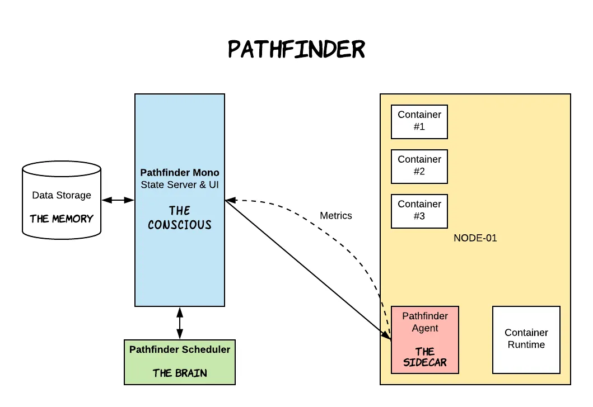
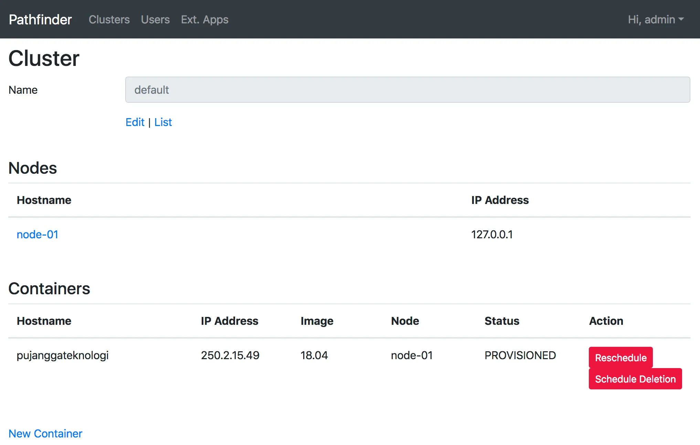

Kubernetes has taken the world by storm. The product open-sourced by Google has indeed become increasingly popular in recent years. Moreover, there are now several Kubernetes-as-a-service offerings that makes it (slightly) easier for people to use Kubernetes without having to deeply understand on how to operate it.

Coincidentally, at the place where I work currently, I was assigned to build a logging infrastructure that runs on LXC. Since we will be managing a fairly large number of containers, we need a container orchestrator capable of handling LXC.

However, up until this point, LXC has not been stably supported by either Kubernetes or Nomad. Therefore, I decided to write my own container orchestrator—might as well take this opportunity to learn something new. :)

## Terminology

**Node**: a physical or virtual server that can host containers

## Pathfinder

We named this container orchestrator Pathfinder. In roughly two weeks, I completed an MVP for Pathfinder so it could be quickly used by another project in my company that is currently in development. We have to extend our thanks to open-source contributors because we save thousands of man-hours by utilizing mature programming languages, toolkits, and frameworks like Ruby, Rails, and Golang, which Pathfinder uses.

The features of Pathfinder's MVP version are very simple:

- Users can register a node to Pathfinder.
- Users can create a container, and Pathfinder will run that container on the appropriate node.
- Users can view the status of the container they just created.

If we look closely, the three features above are the main features of any container orchestrator, because one of the primary tasks of a container orchestrator is to provide an abstraction that makes it easier for developers for deploying containers. This abstraction allows developers to manage application deployments without having to think about resources like hardware or network configurations.

To better understand how Pathfinder implements these needs, let's discuss the components that make up Pathfinder.

## Components of Pathfinder

A container orchestrator is not a single-application component, but a pure distributed system consisting of several separate components. I've identified three main components of a container orchestrator:

1. State server
2. Scheduler A.K.A Controller
3. Agent



Let's discuss each component in turn. The first component is the **state server**, which functions as the single source of truth. This component stores all the information about our current node and container conditions. Users and other components can request or change data by communicating with the state server. The state server typically pairs with a data storage component such as an RDBMS or a key-value store.

Second is the **scheduler** (often called the controller), which acts as the brain of the system. This component periodically queries the state server. If it finds a container that hasn't been assigned to any node, this component decides which node to use for that container.

If we use a push-based method, the scheduler can directly contact the agent on each node to run the container. Conversely, if we use a pull-based method, the scheduler only needs to update the container's node attribute on the state server. At present, Pathfinder uses the pull-based method, so the component responsible for periodically checking the state server for any containers that need to be run is the agent.

The third component, the **agent**, is installed on every node. When using the push-based method, the agent is a server that waits for requests from the scheduler to create or delete a container. When using the pull-based method, the agent periodically queries the state server and creates or deletes containers based on the query results.

In Pathfinder's case, the agent communicates with the LXC runtime, called LXD, via its API. LXD is what actually creates or deletes the containers.

Because we're talking about distributed systems, there are many aspects where we could dive into deeply—especially regarding these three components. In future discussions, we can explore each component's characteristics, how to scale, and how to make them more reliable. But for now, let's try out Pathfinder.

## Trying Pathfinder

Installing Pathfinder is very easy. If you already have Vagrant and VirtualBox installed, you only need to do the following three steps:

```shell
git clone https://github.com/pathfinder-cm/pathfinder-mono.git
cd pathfinder-mono
vagrant up --provision
```

The provisioning script that has been prepared will automatically run post-procedures after the VM boots and it will install the three Pathfinder components for development purposes. This process may take several minutes, but everything will be done automatically.

Once the installation is complete, we can use the Pathfinder CLI, which is also automatically installed. Let's use this CLI to try Pathfinder by running the commands below:

```shell
vagrant ssh
pfi get nodes
```

You will then see an output similar to the one below:

```shell
pfi get nodes

HOSTNAME IPADDRESS CREATED AT
node-01 127.0.0.1 2018-10-13T08:03:50.241Z
```

The command `get nodes` is used to display all nodes registered on the Pathfinder state server.

Now let's try creating a container. Create a container named `pujanggateknologi`.

```shell
pfi create container pujanggateknologi
```

Then, check its creation status by running the following command:

```shell
pfi get containers

HOSTNAME IPADDRESS IMAGE NODE STATUS
pujanggateknologi 18.04 node-01 SCHEDULED
```

`SCHEDULED` indicates that the scheduler has assigned the container to run on `node-01`, and now we just have to wait for the agent to run that container. After a few moments, we can check its status again:

```shell
pfi get containers

HOSTNAME IPADDRESS IMAGE NODE STATUS
pujanggateknologi 250.2.15.49 18.04 node-01 PROVISIONED
```

> When a new node is being created for the first time, the process of creating the container may take a few minutes because the image must be downloaded first.

We can also type the command below to see what commands can be executed via PFI:

```shell
pfi help
```

Besides the CLI, Pathfinder also has a UI that can be accessed at http://192.168.33.33:8080. It looks something like this:



Use the username `admin` and password `pathfinder` to log in.

Congratulations! We have successfully installed Pathfinder and tried out a few commands.

## Roadmap

In the near term, the next milestone for Pathfinder is to improve the reliability aspect, which is one of the most important aspects of a container orchestrator. This can be done by clustering each component and implementing proactive monitoring if there is a problem in one of the components.

Another thing is, of course, adding other essential features to Pathfinder, such as live container migration, autoscaling, and more varied and customizable scheduling algorithms.
