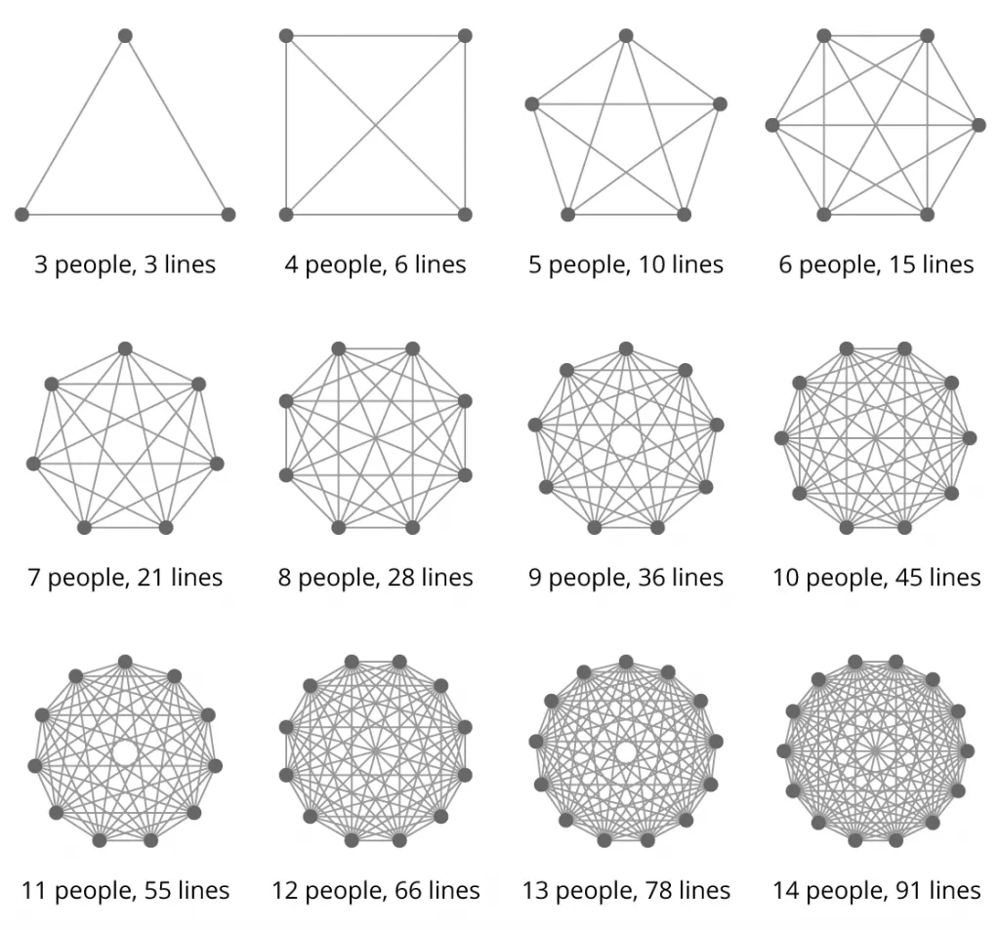

There is abundant literature available when discussing leadership. In fact, there are too many resources and references that it becomes difficult to know where to start when we want to start learning about leadership principles.

This also applies when we discuss leadership in the more specific context of software engineering. Engineering activities, especially software engineering, have specific challenges that require special considerations.

## Focusing on Team Structure

In this article, I'm not planning to start with discussing about leadership in a top-down, comprehensive manner. Instead, I want to start by discussing 1-2 topics that I found interesting to explore and discuss together.

The topic that I want to discuss this time is about the smallest unit of a technical organization: **a team** and the role of **a technical leader**. I chose these two topics because when discussing about leadership, the shape of an  rganization is one of the first decisions that must be made, and that decision will greatly affect many aspects of the organization.

## What Is a Team?

A team is **a collection of individuals who can deliver value to users**. A self-sufficient team typically have individuals with diverse but complementary abilities, so that the team can deliver value to users without having excessive dependence on other parties.

What exactly are a typical software engineering team responsibilities?
- Analyze and plan development activities
- Develop features based on the plans that have been made
- Document the activities so that development can be carried out sustainably
- Participate in on-call support
- Fix errors found in the software

There might be other activities as well that are important for organizational sustainability, such as new member orientation or sharing session between teams.

## Team Size

Team size is a paradox. Why? Because to make a big impact, we generally need a large number of people. However, a large number of people might cause communication complexity to increase dramatically.

However, with the development of technology, the advantage of having a large number of people in an organization to generate impact is diminishing, as [discussed by Deloitte](https://www2.deloitte.com/us/en/insights/focus/business-trends/2013/the-scale-paradox.html). We will not discuss this phenomenon further, but it is interesting to note.

Considering the above, now it's time for us to determine the optimal number of members in a team. One of the last books I read on software engineering leadership was [An Elegant Puzzle](https://lethain.com/elegant-puzzle/) written by [William Larson](https://lethain.com/about/). In the book, Will argues that the ideal number of engineers in a team is between 6 and 8 engineers. That number is ideal because team dynamics change significantly when the number of people is too many or too few. For example:

- Teams with too few people (≤4 people) will have difficulty operating if one team member is sick or on leave.
- Teams with too few people will have difficulty arranging on-call support rotation schedules.
- Teams with too few people will also have difficulty dividing time between maintenance and innovation activities. Often they will only focus on maintenance activities.
- Teams with too many people will have difficulty communicating, and their leaders will have difficulty managing the team.

When we talk about composition of the team, it is strongly influenced by the type of work and the level of difficulty faced by the team. Sometimes several iterations need to be done until we find the right formula and composition. It's generally acceptable to make changes or fine-tune the team composition, as long as we set the right expectations up front and build a good feedback culture.

## Technical Leader / Engineering Manager

Engineering activities are unique because they are carried out by experts and require specific expertise from each team member. In organizations that adhere to the principles of meritocracy, often the person who is the most "knowledgeable" or "skilled" in their trade is expected to become a leader for that team. But this is where it might become a problem, meet [the Peter Principle](https://en.wikipedia.org/wiki/Peter_principle).

> People in a hierarchy tend to rise to their 'level of incompetence'

The above quote can be interpreted: there is a tendency for an employee to be promoted to become a leader or manager because of their past success. This process occurs repeatedly until it reaches the point where they are no longer competent. This is because a person's ability in one field may not necessarily translate to other fields (in the context of our discussion, it means from technical ability to management ability).

To address the above paradox, one of the articles that I think is quite concise but appropriate in discussing the role of a technical leader is the [Tech Lead Manifesto](https://blog.magpiebrain.com/2006/09/12/a-tech-lead-manifesto/) written by Sam Newman.

### A Tech Lead Should:
- Ensure the creation of a clear and consistent technical vision for the project which can best result in a successful project
- Ensure all members of the team have a proper understanding of the technical vision
- Ensure that the technical vision updates to reflect new requirements
- Track and resolve issues where the code deviates from the technical vision
- Create an environment in which all members of the team can contribute towards the technical vision
- Understand and address skills gaps in the team which would result in difficulties implementing the technical vision

### A Tech Lead Should Not:
- Tell everyone what to do
- Necessarily be the best at everything
- Write no code
- Write all the hard code

There is something we can highlight from the manifesto above. One of them in the "A Tech Lead Should Not" section that states "Necessarily be the best at everything" and "Write all the hard code". We have discussed in the previous section that the field of knowledge needed to deliver value to users in software engineering is very broad. It is almost impossible for one person to master and be the best in every field in a team. In addition, this also risks creating a single point of failure, where the unavailability of a technical leader on the team can cause the team failing to operate properly. Of course, this is something that we want to avoid.

Another thing that can be underlined is in the "A Tech Lead Should" section, the majority of the principles listed are related to alignment. Such as alignment between technical vision and needs, alignment between the team and technical vision, and alignment within the team itself. Alignment is the main responsibility that a technical leader must do in managing the team.

Now if we try to conclude, the main message contained in this manifesto is about expectations that are appropriate for a technical leader. By adjusting our expectations, we can reduce the negative effects of Peter Principle and increase the clarity of the role of a technical leader.

---

That concludes the first article on "Software Engineering Leadership". Hopefully, I can explore other topics in future articles. If you have any questions or suggestions, please share them in the comments below.
